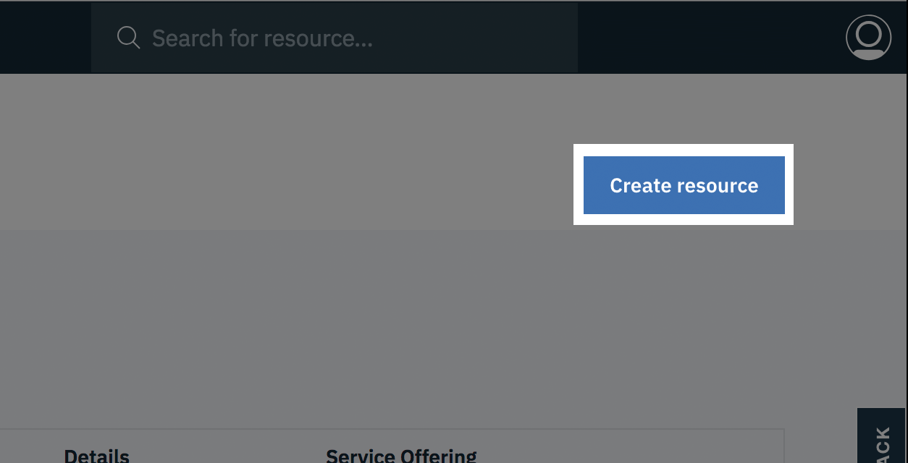
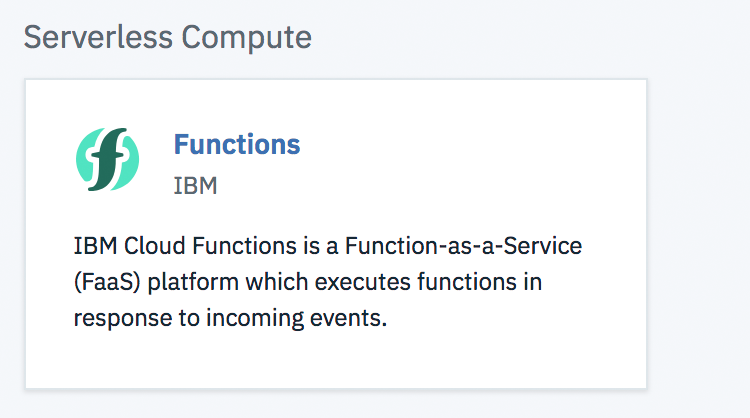
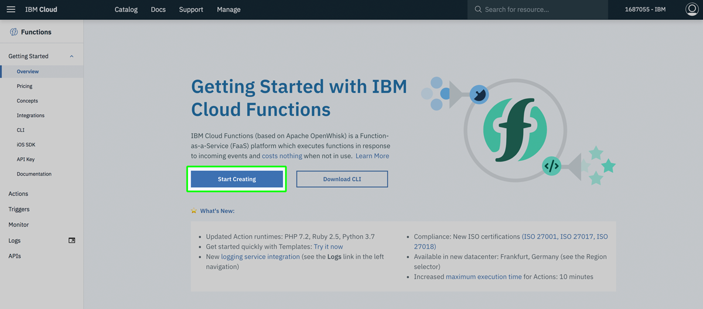
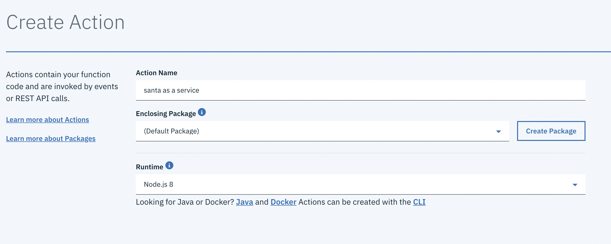
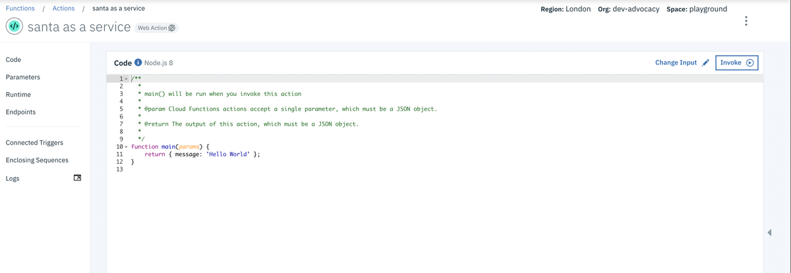
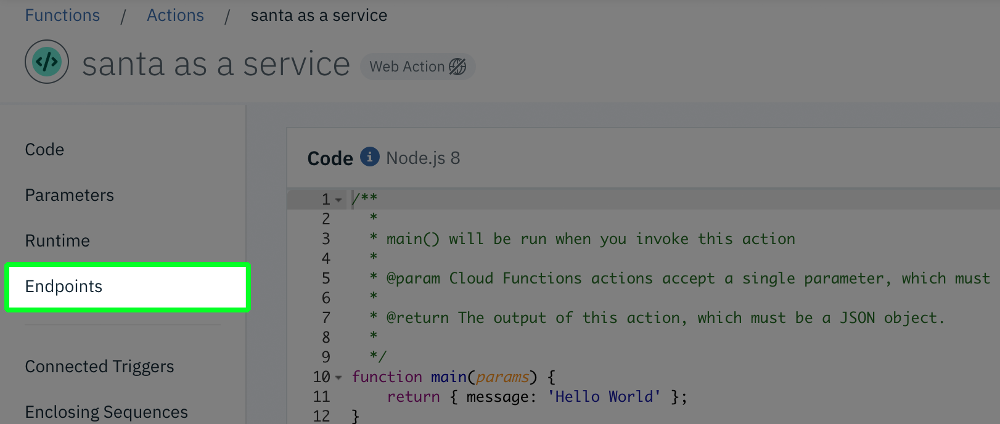
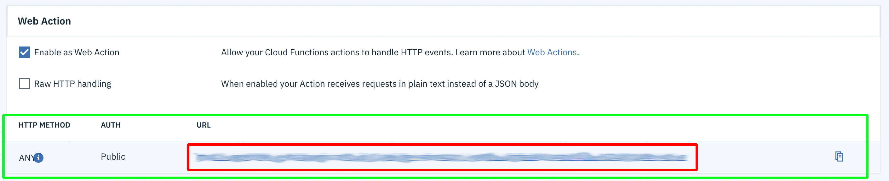
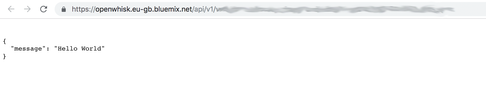

# Serverless, Node-Red & Watson Visual Recognition

## Overview

In this version of the workshop, you will:

- Learn how to deploy a serverless function with IBM Cloud Functions (powered by openwhisk)
    - How to create an action
    - How to define parameters
    - Learn how to activate that function with a HTTP request

## Before you start...

You will need to follow all of the steps to create an IBM Cloud account, Visual recognition service, and Node-RED instance on the [README](../README.md) page of this repo.

## Workshop

Openwhisk can be deployed in myriad ways and locations, and it forms the backbone of the IBM Cloud serverless architecture, so what you learn here can be used in any number of places and services, not just the IBM Cloud.

### Creating our serverless function

1. [log in to your IBM Cloud account](https://cloud.ibm.com/login).
2. On successful login, you'll be taken to your IBM Cloud Dashboard. At the top right of the view, click "Create Resource"

3. Scroll down (or filter in the search bar at the top of the page) until you find the "Functions" box like the one shown in the image:

4. Once you've found the Functions box, click it to be taken to the IBM Cloud Function dashboard. Click on the "Start Creating" button. This will take you to the "Create" page.

5. Once the "Create" page has loaded, click on "Create Action". The "action" is where any serverless code we write will be stored, along with any configuration parameters we provide.

6. You'll now be presented with a configuration page for your new action. Give you action a name, and make sure the runtime that's selected is "Node.js 8". Then hit the "Create" button at the bottom right of the page.

You'll then be taken through to the serverless code editor where we can tell our function what to do once it's been activated.

Congratulations! You've just create a serverless function 🎉 Now we have a place where we can execute some code with some kind of external trigger. In this case, we're going to set up an HTTP endpoint that we can post data to (an image) and have our serverless function process it.

### Configuring our HTTP endpoint

1. On the far left of our current view (the serverless function code page) there is a link called "Endpoints" (highlighted in green in the below image). Click it and you'll be taken to the endpoint configuration page.

Once on the Endpoints page, you'll be presented with a series of check boxes.

2. Toggle "Enable as a Web Action" so that it's ticked. This will connect our serverless function to an HTTP endpoint that external users will be able to use to trigger our function. Click "Save" at the top right of our dialog.

3. Once we've enabled our web action, a new section will appear just beneath the toggle (highlighted with the green box) with details about our newly assigned HTTP endpoint (blurred, but location highlighted in the red box). This is the URL that we can use to trigger, and send data to, our serverless function.

4. Copy and paste that URL into your browser. You should see something like the following

What you're seeing is the result of our serverless function being executed after having been triggered by the HTTP endpoint! Isn't that neat? So far, we're getting the _Hello, World_ code that our function was created with by Openwhisk. Before we work to replace that code with something a little more useful, we're first going to configure some query parameters to enable our action to talk to Watson Visual Recognition.