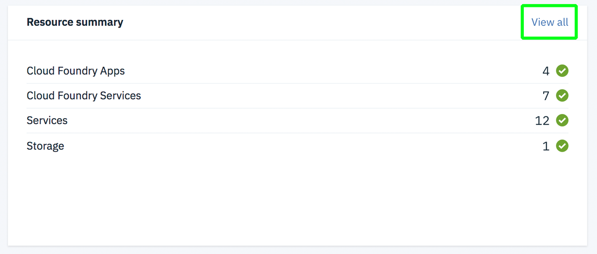
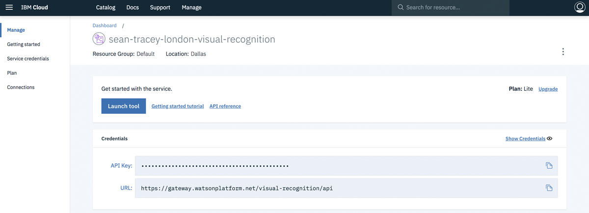
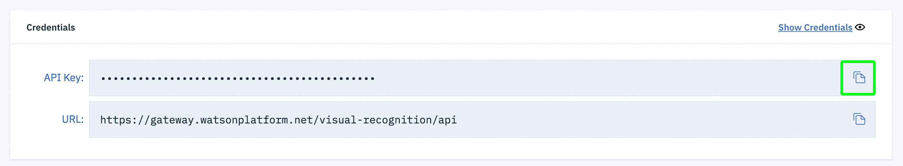
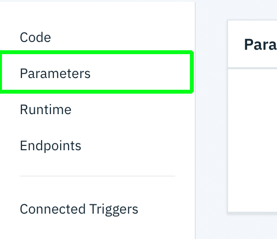
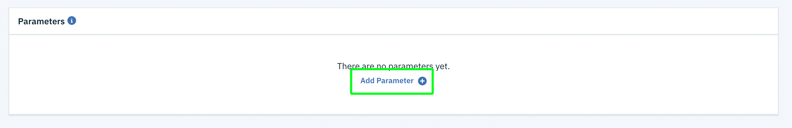
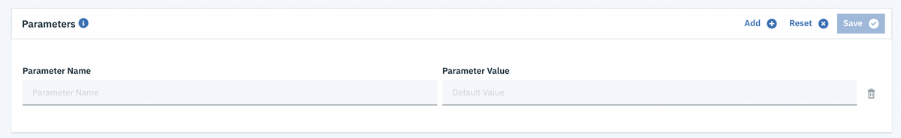
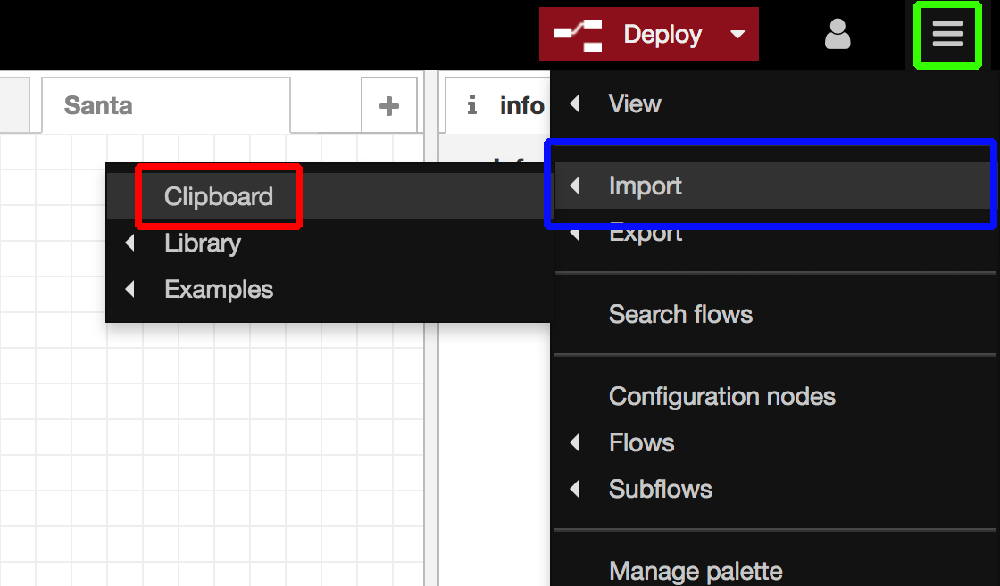
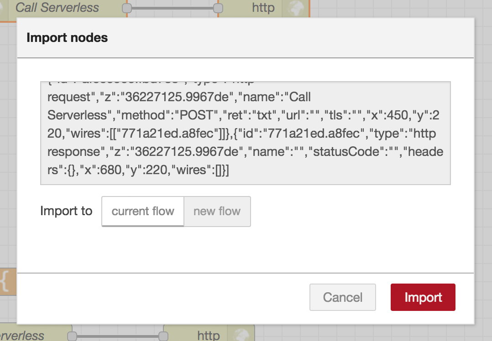
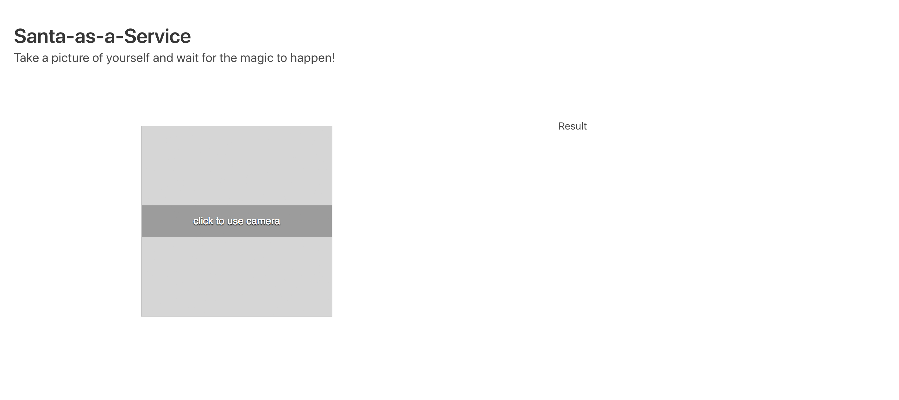
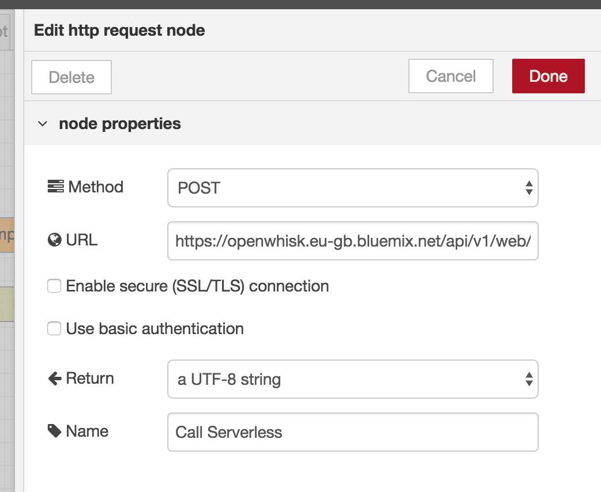

# Serverless, Node-Red & Watson Visual Recognition

## Overview

In this version of the workshop, you will:

- Learn how to deploy a serverless function with IBM Cloud Functions (powered by openwhisk)
    - How to create an action
    - How to define parameters
    - Learn how to activate that function with a HTTP request

## Before you start...

You will need to follow all of the steps to create an IBM Cloud account, Visual recognition service, and Node-RED instance on the [README](../README.md) page of this repo.

## Workshop

Openwhisk can be deployed in myriad ways and locations, and it forms the backbone of the IBM Cloud serverless architecture, so what you learn here can be used in any number of places and services, not just the IBM Cloud.


### Creating our serverless function

1. [log in to your IBM Cloud account](https://cloud.ibm.com/login).
2. On successful login, you'll be taken to your IBM Cloud Dashboard. At the top right of the view, click "Create Resource"


3. Scroll down (or filter in the search bar at the top of the page) until you find the "Functions" box like the one shown in the image:


4. Once you've found the Functions box, click it to be taken to the IBM Cloud Function dashboard. Click on the "Start Creating" button. This will take you to the "Create" page.


5. Once the "Create" page has loaded, click on "Create Action". The "action" is where any serverless code we write will be stored, along with any configuration parameters we provide.


6. You'll now be presented with a configuration page for your new action. Give you action a name, and make sure the runtime that's selected is "Node.js 8". Then hit the "Create" button at the bottom right of the page.


You'll then be taken through to the serverless code editor where we can tell our function what to do once it's been activated.


Congratulations! You've just create a serverless function 🎉 Now we have a place where we can execute some code with some kind of external trigger. In this case, we're going to set up an HTTP endpoint that we can post data to (an image) and have our serverless function process it.

### Configuring our HTTP endpoint

1. On the far left of our current view (the serverless function code page) there is a link called "Endpoints" (highlighted in green in the below image). Click it and you'll be taken to the endpoint configuration page.


Once on the Endpoints page, you'll be presented with a series of check boxes.

2. Toggle "Enable as a Web Action" so that it's ticked. This will connect our serverless function to an HTTP endpoint that external users will be able to use to trigger our function. Click "Save" at the top right of our dialog.

3. Once we've enabled our web action, a new section will appear just beneath the toggle (highlighted with the green box) with details about our newly assigned HTTP endpoint (blurred, but location highlighted in the red box). This is the URL that we can use to trigger, and send data to, our serverless function.


4. Copy and paste that URL into your browser. You should see something like the following


What you're seeing is the result of our serverless function being executed after having been triggered by the HTTP endpoint! Isn't that neat? So far, we're getting the _Hello, World_ code that our function was created with by Openwhisk. Before we work to replace that code with something a little more useful, we're first going to configure some query parameters to enable our action to talk to Watson Visual Recognition.

### Obtaining Visual Recognition Credentials

First things first, before we can assign some Visual Recognition credentials to our serverless function, we need to generate them!

If you don't have a Watson Visual Recognition service already provisioned in your IBM Cloud account, you can find the instructions on the [main README](../README.md) of this repository. Go there, provision your Watson Visual Recognition instance, then come back here.

1. In another tab, Head to your [IBM Cloud Dashboard](https://cloud.ibm.com).
2. Click on the "view all" button in the resource summary section of your dashboard (highlighted in green).



3. This will take you to your resources list for your IBM Cloud account. Expand the "Services" section and select the Watson Visual Recogntion instance you have already created. This will take you through to the dashboard for your Visual Recognition instance.



4. On this page there is an "API Key" field. Click the copy icon next to the field (highlighted in green) to copy your Visual Recognition API key to your clipboard.

.

### Creating a parameter for your serverless function

If we want our serverless function to have access to private, pre-defined values we can create "Parameters". These behave much in the same way that environment variables do in a normal server application, but instead of persisting in the environment of the application, they are instead passed to the serverless function as a parameter when it's executed.

1. Head back to your serverless function page. On the left hand of the display, click the "Parameters" link in the menu.



2. Once the view has loaded, you'll see a button to "Add Parameter" (highlighted in green). Click the button.



3. You'll now be presented with an input form to add parameters to your function. In the field for "Parameter name" add **WATSON_VISUAL_RECOGNITION_KEY** and in the input field for "Parameter value" paste the API key for your Watson Visual Recognition instance. 

**You must put the API key inside of double quotes**, so it should look something like `"<YOUR_WATSON_API_KEY>"`



4. Click the "Save" button at the top right of the dialog to save your paramters.

Now, whenever we activate our function, we have access to an API key that we can use to make a request to our Visual Recognition instance. 

### Creating the code for our function

Now that we have everything set up to support our serverless function, it's time to start putting it together!

The function we'll be writing will be in JavaScript, but some of our dependencies (the Watson SDKs) require compilation for the target system (our serverless function), so we'll need to write our code, and then upload it with it's pre-compiled dependencies as a .zip file.

Before we get to that, please follow [these instructions](https://console.bluemix.net/openwhisk/learn/cli) to install the IBM Cloud Openwhisk CLI tools. 

1. If you've not done so already, clone or download this repository to your system and then open up the path in your terminal.
2. Once in the root path of this repository, navigate to the "code" folder by running the command `cd workshop\ 2/code/`
3. In here, you should have a `package.json` file, a small `index.js` file and a `dependencies.zip` file. These are all of the files we'll need to author, upload and run our serverless function.
4. Open the index.js file in your favourite IDE (code editor). It should contain the following:

```javascript
var VisualRecognitionV3 = require('watson-developer-cloud/visual-recognition/v3');

function main(params) {

    // Snippet 1

}

exports.main = main;
```

5. The first bit of code we're going to add to our serverless function is some conditional expressions to check that we have everything we need to run. Copy and paste the following just after `// Snippet 1`:

```javascript
if(!params.WATSON_VISUAL_RECOGNITION_KEY){
        
        return {
            statusCode: 500,
            headers : {
                "Content-Type" : "application/json"
            },
            body : JSON.stringify({ status : "err", message : `The parameter "WATSON_VISUAL_RECOGNITION_KEY" has not been set.` })
        };

    } else if(params.__ow_headers['content-type'] !== "application/json"){
   
        return {
            statusCode: 400,
            headers : {
                "Content-Type" : "application/json"
            },
            body : JSON.stringify({ status : "err", message : `Invalid Content-Type headers. Got ${params.__ow_headers['content-type']}, expected "application/json"` })
        };
   
    } else if(params.__ow_method !== "post"){
   
        return {
            statusCode: 400,
            headers : {
                "Content-Type" : "application/json"
            },
            body : JSON.stringify({ status : "err", message : `Invalid HTTP request verb. Got ${params.__ow_method}, expected POST` })
        };
   
    } else if(params.image){

        // Snippet 2

    }

}
```

Here, we're first checking that we have a Watson Visual Recognition key passed as a parameter (which we set in the previous group of instructions). If it's not present, we end the execution of the serverless funciton and return an object that will be converted to an HTTP response by IBM Cloud Functions.

Next, we check that we're receiving a JSON object in the body of any HTTP request. Our function is going to expect a Base-64 encoded image in the body of any HTTP requests it receives. If we don't have the right `Content-Type` header, we again terminate the function and return a message asking for a properly formatted HTTP header.

Finally, we check that we're receving a request with the appropriate HTTP verb (in this case, `POST`). If we have the wrong HTTP verb being used for the request, we again terminate the process, and ask for the correct HTTP verb.

Assuming all of these conditions are met, we're able to start thinking about how we want to handle the image being receieved.

6. First up, we're going to convert our Base-64 encoded image into a Node.js Buffer. If our HTTP request has been formatted correctly, our image will be passed on the `image` property of the `params` object that is passed to our `main()` function. Watson accepts file buffers as an upload type, and it's a very simple, quick conversion, so we'll do that first. Beneath `// Snippet 2` copy and paste the following:

```javascript
const imageBuffer = Buffer.from(params.image, 'base64');
// Snippet 3
```

7. Now that we have our image converted into a file format that Watson accepts, we're reayd to start putting that request together. Copy and paste the following just beneath `// Snippet 3`:

```javascript
const visualRecognition = new VisualRecognitionV3({
    version: '2018-03-19',
    iam_apikey: params.WATSON_VISUAL_RECOGNITION_KEY
});

var params = {
    images_file: imageBuffer
};

// Snippet 4
```

8. With `visualRecognition`, we now have an object we can use to communicate with our Visual Recognition service, so let's put that together. Our serverless function expects a `return` statement to signify the end of our codes execution, but our request to the Watson APIs are asyncronous, so we're going to return a `Promise` object with the Watson request wrapped inside. Just beneath `// Snippet 4` copy and paste the following:

```javaScript
return new Promise( (resolve, reject) => {

    visualRecognition.detectFaces(params, function(err, result) {
        if (err) {

            reject({
                headers : {
                    "Content-Type" : "application/json"
                },
                body : JSON.stringify(err)
            });

        } else {
            
            // Snippet 5

        }
    });

} );
```

9. After a short time, Watson should return to us information about every face that it could find in the image we passed to it. For this workshop, we're not interested in the gender or age details of each face, we only want to return the coordinates of each face so we can santa-fy them. So, we're going to map over the Watson results and only return the coordinates for each identified face. Copy and paste the following just beneath `// Snippet 5`:

```javascript
const faces = result.images[0].faces.map( face => {

    return face.face_location;

} );

resolve( {
    headers : {
        "Content-Type" : "application/json",
        'Access-Control-Allow-Origin' : '*'
    },
    body : JSON.stringify( { faces } )
} );

```

10. That's it! We now have all the code we need for our serverless function. It's time to deploy it.

### Packaging and deploying our function as a .zip file

Because our serverless function has dependencies (the Watson SDKs) we need to package them up with our JavaScript and upload them to IBM Cloud. Because we're using Node.js, this is super-easy to do with npm scripts.

1. Still in the `/code` directory of the workshop 2 folder, run `npm run package`. This will unzip the `dependencies.zip` file into `/node_modules` and package it up along with `index.js` and `package.json` into a new file `action.zip`.

`action.zip` is what we'll be uploading to our serverless function with the IBM Cloud CLI tools.

Assmuming you've already followed [these instructions](https://console.bluemix.net/openwhisk/learn/cli) to install the IBM Cloud CLI tools on your system, we're ready to put this thing in the cloud!

2. First, you'll need to login to the IBM Cloud with the CLI tools. Run `ibmcloud` and follow the onscreen command prompts. Make sure that the API endpoint matches the region you created your serverless function in.

3. Next run `ibmcloud target --cf` to target the Cloud Foundry org/space that you created your serverless function in. If you're not sure what these are, you can see them listed at the top of the page where you created your HTTP endpoint / assigned parameters.

3. And you're in! It's time to upload your `action.zip` package to IBM Cloud functions, run the following command from your terminal inside the same folder that `action.zip` is in. Replace `<YOUR_SERVERLESS_ACTION_NAME>` with the name of your action name.

```ibmcloud fn action update "<YOUR_SERVERLESS_ACTION_NAME>" action.zip --kind nodejs:8 --verbose```

Notice how we're defining the type of environment we want our function to execute in with the `--kind` flags. Here, we're telling openwhis that we want our function to be executed with Node.js.

4. And that's it! Our serverless function is now up in the cloud and ready to start processing images. Let's integrate something with it!.

### Calling our serverless function

Now we have a serverless function to call, we're going to call it. To avoid having a discussion about CORs, we're still going to use Node-RED as a proxy to take the request from our web page, pass it on to our serverless function, and then pass the result(s) back to our web page.

If you've not followed Workshop 1 and jumped straight into this one, no worries, we can set up the template we need very quickly.

If you have followed workshop 1, it's best to still follow these instructions to avoid unnecessary complexity. Just create a new Node-RED flow by hitting the "+" at the top right of your screen next to your existing flow tabs.

1. Expand the dropdown below and copy all of the JSON inside to your clipboard.

<details>
<summary>Click to see the flow JSON file</summary>
<br>
   
```json
[{"id":"dca025fb.88b7a8","type":"http in","z":"36227125.9967de","name":"Give me a beard! ","url":"/beard-me-serverless","method":"get","upload":false,"swaggerDoc":"","x":180,"y":160,"wires":[["5ded4c85.2ef034"]]},{"id":"1e9bdb91.fe7c04","type":"template","z":"36227125.9967de","name":"","field":"payload","fieldType":"msg","format":"handlebars","syntax":"mustache","template":"<!DOCTYPE html>\n<html>\n\n<head>\n  <meta charset=\"utf-8\">\n  <meta name=\"viewport\" content=\"width=device-width, initial-scale=1\">\n  <title>Santa-as-a-Service</title>\n  <link rel=\"stylesheet\" href=\"https://cdnjs.cloudflare.com/ajax/libs/bulma/0.7.2/css/bulma.min.css\">\n  <style type=\"text/css\">{{{payload.style}}}</style>\n  \n  <script defer src=\"https://use.fontawesome.com/releases/v5.3.1/js/all.js\"></script>\n    <script src=\"https://unpkg.com/@webcomponents/custom-elements\"></script>\n    <script src=\"https://unpkg.com/@webcomponents/shadydom\"></script>\n  <script src=\"/web-components/camera\"></script>\n</head>\n\n<body>\n  <section class=\"section\">\n    <div class=\"container\">\n      <h1 class=\"title\">\n        Santa-as-a-Service\n      </h1>\n      <p class=\"subtitle\">\n        Take a picture of yourself and wait for the magic to happen!\n      </p>\n    </div>\n  </section>\n  <section class=\"section\">\n    <div class=\"columns\">\n      <div class=\"column\" id=\"upload\">\n        <node-red-camera data-nr-name=\"beard-picture\" data-nr-type=\"still\"></node-red-camera>\n      </div>\n      <div id=\"pic-before\" style=\"height:480px; width:640px;\">\n        Result\n      </div>\n    </div>\n  </section>\n\n\n  <script>\n    {{{payload.script}}}\n  </script>\n</body>\n\n</html>","output":"str","x":660,"y":160,"wires":[["41ceac08.cd2974"]]},{"id":"41ceac08.cd2974","type":"http response","z":"36227125.9967de","name":"","statusCode":"","headers":{},"x":790,"y":160,"wires":[]},{"id":"5ded4c85.2ef034","type":"template","z":"36227125.9967de","name":"JavaScript","field":"payload.script","fieldType":"msg","format":"javascript","syntax":"mustache","template":"(function () {\n\n    'use strict';\n    // select the camera element in the DOM\n    const camera = document.querySelector('node-red-camera');\n\n    // listen to an event when a picture is taken\n    camera.addEventListener('imageavailable', function (data) {\n        let img = ''\n        document.body.querySelector('#pic-before').innerHTML = img;\n        \n        console.log(data.detail);\n        const imageData = data.detail.replace('data:image/png;base64,', '');\n        \n        // Snippet 1\n        \n    });\n\n}());","output":"str","x":350,"y":160,"wires":[["ac2034e1.072998"]]},{"id":"ac2034e1.072998","type":"template","z":"36227125.9967de","name":"Stylesheet","field":"payload.style","fieldType":"msg","format":"css","syntax":"mustache","template":"#pic-before {\n    width: 640px !important;\n    height: 480px !important;\n    position: relative;\n    overflow: hidden;\n    flex: 0 0 640px;\n}\n.beard {\n  position: absolute;\n  display: block;\n  /*background-image: url(https://svgshare.com/i/9j4.svg);*/\n  background-image: url(https://vignette.wikia.nocookie.net/clubpenguin/images/3/34/FuzzyWhiteBeard.png);\n  background-size: 100% 100%;\n  background-repeat: no-repeat;\n}\n.beard img {\n  position: absolute;\n  display: block;\n  width: 100%;\n  height: 100%;\n  top: 0;\n  left: 0;\n}","output":"str","x":510,"y":160,"wires":[["1e9bdb91.fe7c04"]]},{"id":"ac8609c1.17f4e8","type":"http in","z":"36227125.9967de","name":"","url":"/get-coords","method":"post","upload":false,"swaggerDoc":"","x":190,"y":220,"wires":[["afce6966.fbd788"]]},{"id":"afce6966.fbd788","type":"http request","z":"36227125.9967de","name":"Call Serverless","method":"POST","ret":"txt","url":"","tls":"","x":450,"y":220,"wires":[["771a21ed.a8fec"]]},{"id":"771a21ed.a8fec","type":"http response","z":"36227125.9967de","name":"","statusCode":"","headers":{},"x":680,"y":220,"wires":[]}]
```
</details>

2. Head back to your Node-RED instance. At the top right of the display click the hambuger icon (highlighted in green) and then go down to "import" (highlighted in blue) and then click "Clipboard" (highlighted in red)



3. Paste the contents of your clipboard into the dialog window that opens up (pictured below) and click "import". A series of nodes will appear on your content. Click to place them somewhere.



4. Now, if you head to the page `/beard-me-serverless`. This path is relative to your Node-RED instance, so if your Node-RED URL is `https://awesome-node-red-project.eu-gb.mybluemix.net/`, then you'll want to head to `https://awesome-node-red-project.eu-gb.mybluemix.net/beard-me-serverless`.

5. Once the page loads, you should see something like the following. Other than activating the camera, it won't do much right now, so we'll have to tweak some things first.



6. Go back to your Node-RED flow and double click on the node called "Call Serverless". This open up a dialog enabling you to configure an endpoint that this node can call when triggered. Paste in the URL for your serverless function (which you can retrieve from the page that we assigned our HTTP endpoint with) making certain to remove the `.json` from the end of the URL, and the select the "POST" method. Click done to save these setting.



7. Next, it's time to update the JavaScript for our flow. Double-click the `JavaScript` node in your flow to configure it. Copy and paste the following code just beneath the line `// Snippet 1`.

```javascript
const serverlessURL = `${window.location.origin}/get-coords`;
const parameters = {
    body : JSON.stringify({ image : imageData }),
    headers : {
        "Content-Type" : "application/json"
    },
    method : "POST"
};

fetch(serverlessURL, parameters)
    .then(function(res){
        if(res.ok){
            return res.json();
        } else {
            throw res;
        }
    })
    .then(function(response){
        
        console.log(response);
        
        // Snippet 2

    })
    .catch(function(err){
        console.log(err);       
    })
;
```

Now we have code that capture an image, send it to our serverless function (via Node-RED) and then read the results from the execution of our serverless function. But is this good enough? **NO!** We came here to be bearded, and that's what we're gonna do.

8. Copy and paste the following code just beneath `// Snippet 2` in our "JavaScript" node. This code will take the response from our serverless function and map beards to the identified faces! ✨🎅✨

```javascript
response.faces.forEach(function (element) {
    var top = element.top;
    var left = element.left;
    var width = element.width;
    var height = element.height;
    var beard_elem = '<div class="beard" style="top: '+ (0.50 * height + (top+10)) +'px; left: '+ (left+10) +'px; width: '+ (width - 20) +'px; height: '+ height +'px;"></div>';
    document.body.querySelector('#pic-before').innerHTML += beard_elem;
});
```

9. Once you've copied and pasted the code click "Done" in the config dialog, and then click deploy. Head back to your `/beard-me-serverless` endpoint, reload the page, and you're ready to be Santa-d 🎉